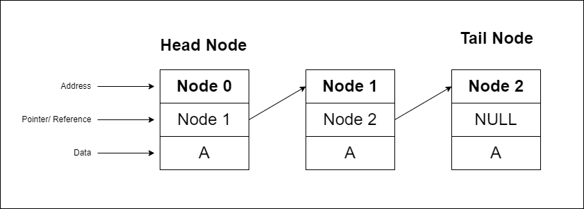

# Data Structures

# [Linked List](./composite/linked-list/)
## [Simple Singly Linked List](./composite/linked-list/simple-signly-linked-list.py)

  
  
<em>Simple Singly Linked List Illustration.</em>

The code implements a singly linked list using the Node class, initializing nodes with data and connections. It traverses the list and prints data, showcasing linked list implementation in Python.

## [Advanced Singly Linked List](./composite/linked-list/advanced-signly-linked-list.py)
The code implements a singly linked list data structure in Python, allowing insertion, deletion, size calculation, and reversal of the list, showcasing linked list implementation in Python.

